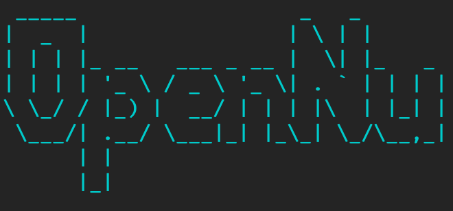

High-performance C++ solver for Lindblad master equations and open quantum systems with neutrinos. 

Using the [Eigen](https://gitlab.com/libeigen/eigen) library, already included in the project.

## Installing 

The only requirement is a working C++ compiler, such as the GNU g++.

```bash
git clone https://github.com/gpierobon/OpenNu.git
cd OpenNu
make
```
## Usage

A run with default values simply by calling:
```bash
./OpenNu
```
The available paramters can be found by running:
```bash
./OpenNu --info
```

